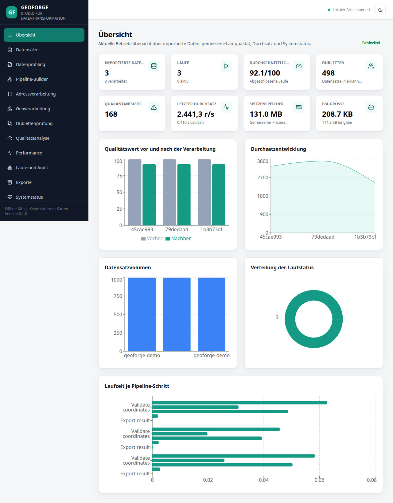
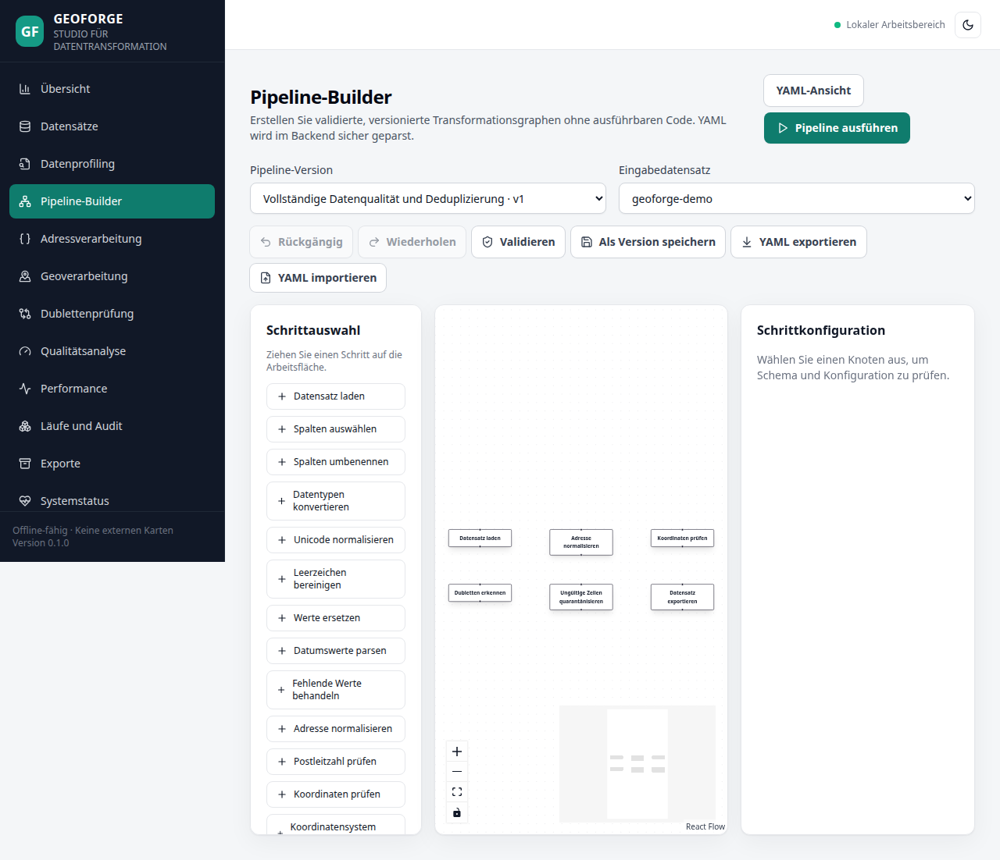
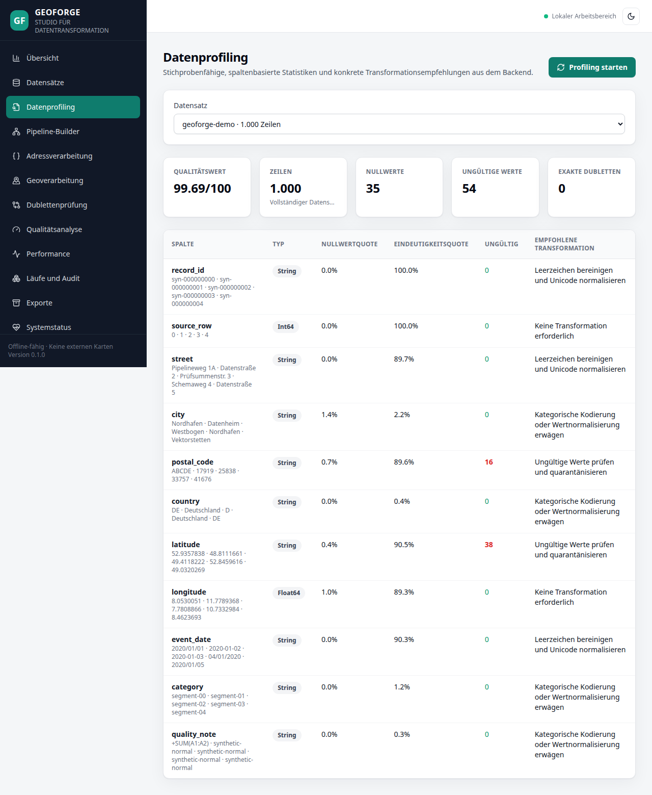
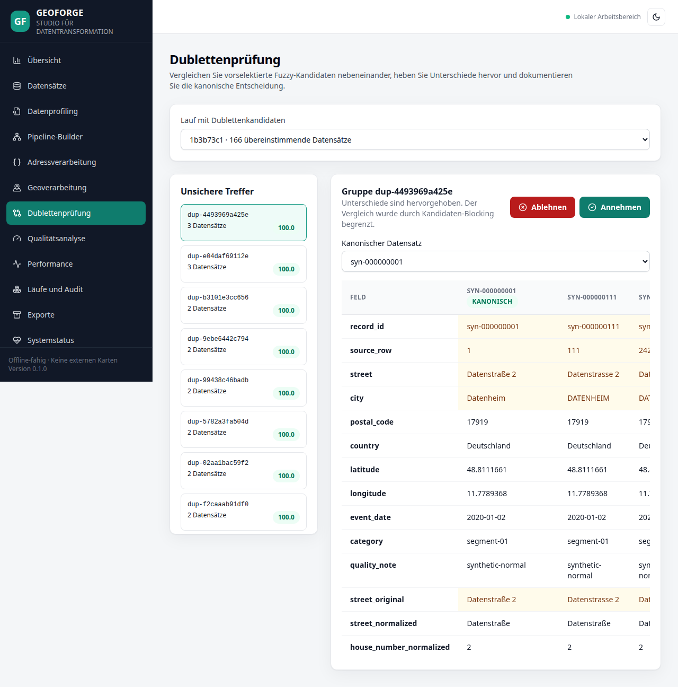
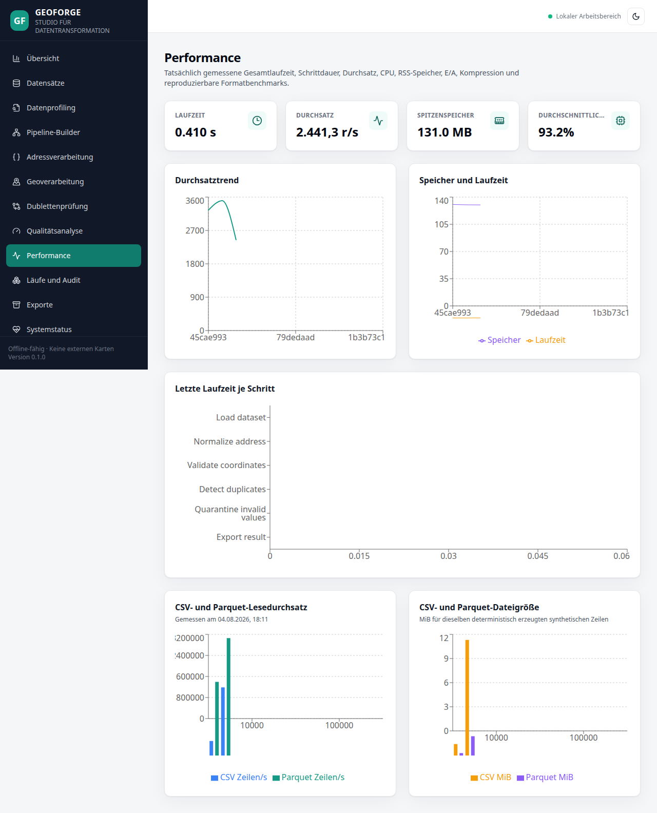
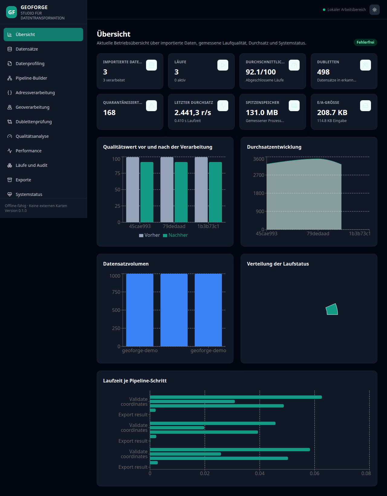
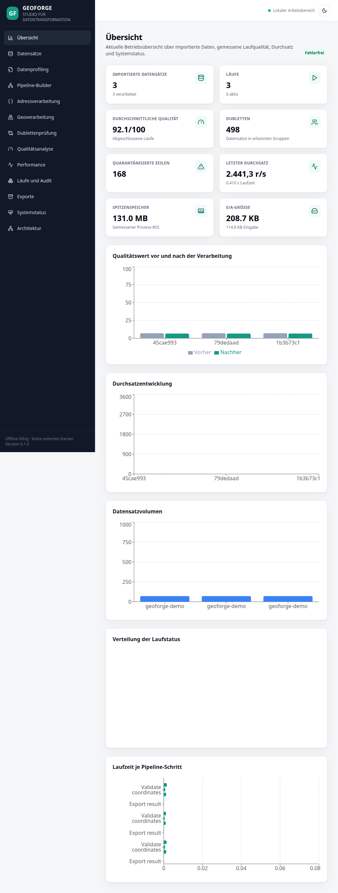
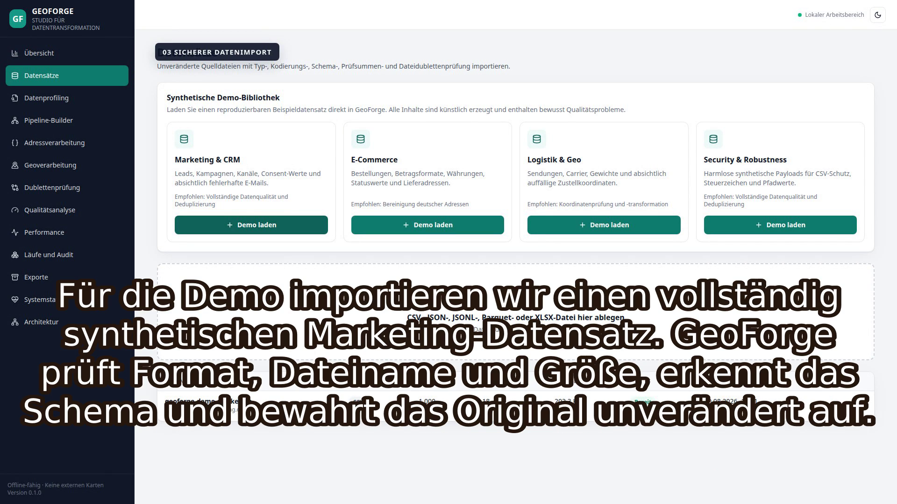

<div align="center">

# GeoForge Studio

### High-Performance Address, Geo & Data Transformation Platform

Eine produktionsnahe, offline-fähige Data-Engineering-Plattform für Datenimport,
Profiling, Adress- und Geoverarbeitung, Dublettenerkennung, visuelle Pipelines,
Qualitätsanalyse und auditierbare Exporte.


**Anwendung ohne API-Schlüssel · keine externen Karten- oder Geocodingdienste · vollständig synthetische Demodaten**

</div>



## Warum GeoForge Studio?

GeoForge Studio bildet einen vollständigen Data-Engineering-Arbeitsablauf in einer
professionellen Weboberfläche ab: Dateien werden sicher importiert, statistisch
profiliert, über versionierte Pipelines bereinigt, fachlich geprüft und zusammen mit
Qualitäts-, Performance- und Auditnachweisen exportiert. Die Anwendung ist als
technische Referenz für das SOLCOM-Projekt **„Python Data Processor“** entstanden –
nicht als Notebook oder Streamlit-Prototyp, sondern als ausführbare Full-Stack-Anwendung.

### Kernfunktionen

- **Sicherer Datenimport:** CSV, JSON, JSONL, Parquet und XLSX mit Vorschau,
  Schema-Inferenz, Encoding-/Trennzeichenerkennung, SHA-256-Prüfsummen und
  Dateidublettenprüfung.
- **Datenprofiling:** Nullwerte, Kardinalität, Quantile, häufige Werte, Ausreißer,
  Validierungsfehler, exakte Dubletten und ein nachvollziehbarer Quality Score.
- **Adressverarbeitung:** Unicode-, Leerzeichen-, Straßen-, Hausnummer-, PLZ-,
  Orts- und Ländernormalisierung mit erhaltenen Originalwerten.
- **Geoverarbeitung:** Koordinatenprüfung, Tausch-Erkennung, frei konfigurierbare
  CRS-Transformationen, Haversine-Distanzen, Bounding Boxes und lokale Punktkarte.
- **Skalierbare Deduplizierung:** Exact, Normalized und gewichtetes Fuzzy Matching
  mit Blocking, begrenzten Kandidatengruppen und manueller Review-Entscheidung.
- **Visueller Pipeline-Builder:** React Flow, Konfigurationspanel, Undo/Redo,
  Schrittvalidierung, sichere YAML-Ansicht, Import/Export und Versionierung.
- **Reproduzierbare Läufe:** Abbruch, Timeout, Quarantäne, Lauf- und Schrittmesswerte,
  Pipeline-Prüfsummen sowie persistente Run-Historie.
- **Auditierbare Exporte:** CSV, JSONL und Parquet plus Qualitätsbericht,
  Leistungsbericht, Quarantäne, Manifest, Audit-Log, Pipeline-YAML und Prüfsummen.

## Einblicke in die Anwendung

| Visueller Pipeline-Builder | Datenprofiling |
|---|---|
|  |  |

| Dublettenprüfung | Performance-Dashboard |
|---|---|
|  |  |

| Dark Mode | Responsive Tablet-Ansicht |
|---|---|
|  |  |

### Direkt ladbare Demo-Szenarien



Vier deterministische 1.000-Zeilen-Szenarien lassen sich ohne Dateiauswahl direkt
in der Datensatzseite laden. Die sichtbare Empfehlung führt jeweils zur passenden
Adress-, Geo- oder vollständigen Quality-/Dedup-Pipeline.

Weitere geprüfte Screenshots aller 13 Hauptseiten liegen unter
[`artifacts/ui-review`](artifacts/ui-review). Details zu Browser-, Responsive- und
Accessibility-Prüfungen stehen im [`UI_REVIEW_REPORT.md`](UI_REVIEW_REPORT.md).

## Schnellstart

### Voraussetzungen

- Python 3.12
- npm 9 oder neuer; der Bootstrap installiert die für Playwright gesperrte
  Node-Laufzeit ausschließlich projektlokal unter `frontend/node_modules`
- lokaler Chrome-Browser für Playwright
- optional: Docker mit Compose v2

Beim einmaligen Bootstrap werden alle Abhängigkeiten ausschließlich in `.venv` und
`frontend/node_modules` installiert:

```bash
git clone https://github.com/ghostvenumai/geoforge-studio.git
cd geoforge-studio
./scripts/bootstrap.sh
```

Danach Demodaten erzeugen und die Anwendung starten:

```bash
.venv/bin/python scripts/generate_demo_data.py \
  --rows 1000 \
  --seed 42 \
  --output data/samples/geoforge-demo.csv \
  --format csv \
  --error-rate 0.12 \
  --duplicate-rate 0.08

./scripts/start_demo.sh
```

Optional stehen vier weitere thematische Demodatensätze bereit, die dieselben
Adress- und Geospalten verwenden und daher ohne Anpassung mit den vorhandenen
Beispielpipelines laufen:

```bash
.venv/bin/python -m scripts.generate_themed_demo_data --rows 1000 --seed 42
```

- **`geoforge-demo-security.csv`** – demonstriert die Sicherheitsmechanismen:
  Spreadsheet-Formel-Payloads, Steuerzeichen, Traversal-Strings und überlange
  Werte, die beim Import bereinigt, in Quarantäne verschoben bzw. beim
  CSV-Export escaped werden. Alle Payloads sind harmlos und rein synthetisch.
- **`geoforge-demo-marketing.csv`** – CRM-/Lead-Daten mit Kampagnen, Kanälen,
  Consent-Flags und fehlerhaften E-Mail-Adressen für Dedup- und Qualitätsdemos.
- **`geoforge-demo-ecommerce.csv`** – Bestelldaten mit lokal formatierten
  Beträgen, Währungsvarianten und Lieferadressen.
- **`geoforge-demo-logistics.csv`** – Sendungsdaten mit Zustellkoordinaten,
  Gewichten und Carrier-Informationen für Geo-Validierung und Distanzen.

Nach dem Start stehen dieselben vier Szenarien oben unter **Datensätze →
Synthetische Demo-Bibliothek** über **Demo laden** bereit. Eine lokale Datei muss
dann nicht manuell ausgewählt werden.

Anschließend im Browser öffnen:

- Weboberfläche: <http://127.0.0.1:5173>
- API-Healthcheck: <http://127.0.0.1:8000/api/health>
- OpenAPI-Dokumentation: <http://127.0.0.1:8000/docs>

Wenn Port `8000` bereits belegt ist, kann ein anderer Backend-Port gewählt werden.
Das Frontend übernimmt ihn beim Start automatisch:

```bash
GEOFORGE_BACKEND_PORT=18080 ./scripts/start_demo.sh
```

Beenden:

```bash
./scripts/stop_demo.sh
```

Eine genaue Erklärung jeder Seite und jedes Arbeitsschritts enthält die
[`BEDIENUNGSANLEITUNG.md`](BEDIENUNGSANLEITUNG.md).

## Empfohlener Demo-Ablauf

1. Unter **Datensätze** `data/samples/geoforge-demo.csv` hochladen.
2. Unter **Datenprofiling** die Qualitätsanalyse starten und Fehler untersuchen.
3. Im **Pipeline-Builder** „Vollständige Datenqualität und Deduplizierung“ öffnen,
   validieren und mit dem importierten Datensatz ausführen.
4. Unter **Läufe und Audit** den realen Fortschritt und die Schrittmesswerte prüfen.
5. In **Qualitätsanalyse** Vorher/Nachher vergleichen und in **Dublettenprüfung**
   einen kanonischen Datensatz auswählen.
6. Unter **Performance** Laufzeit, Durchsatz, CPU und Spitzenspeicher öffnen.
7. Unter **Exporte** das Parquet-Ergebnis und das Audit-Manifest herunterladen.

Für Präsentationen stehen ein
[`Fünf-Minuten-Ablauf auf Deutsch`](FIVE_MINUTE_DEMO_DE.md) und eine
[`englische Version`](FIVE_MINUTE_DEMO_EN.md) bereit.

## Architektur

```text
React + TypeScript + Vite
        │
        ▼
FastAPI + Pydantic v2
        │
        ├── Polars / PyArrow / DuckDB
        ├── Address & Geo Processing / pyproj
        ├── Blocking & RapidFuzz Deduplication
        └── Pipeline Engine / Quality / Metrics
        │
        ▼
SQLite-Metadaten + unveränderte Uploads + Run-Artefakte
```

Die Anwendung ist als modularer Monolith aufgebaut. API-Routen bleiben von der
Fachlogik getrennt; Pipeline-YAML wird mit `yaml.safe_load` verarbeitet und kann nur
Operatoren aus einer festen, typisierten Registry aufrufen. Eine ausführliche
Beschreibung und die Architekturentscheidungen stehen in
[`ARCHITECTURE.md`](ARCHITECTURE.md) und [`docs/decisions`](docs/decisions).

## Qualität und Tests

```bash
make quality   # Ruff, MyPy, Backend-Unit-Tests, ESLint, TypeScript, Vitest
make full      # Integration, Coverage, Security, Dependency, Playwright, axe
make release   # Production Build, Demo, Benchmark, optionaler Docker-Smoke-Test
```

Zuletzt lokal am 10. August 2026 verifiziert:

- **109 Python-Tests bestanden**
- **92,69 % Backend Branch Coverage** bei einem Gate von 90 %
- **9 Vitest-Tests bestanden**
- **3/3 Playwright-/axe-Szenarien bestanden**: Desktop, Tablet und Mobil
- **Ruff, MyPy, ESLint und TypeScript strict bestanden**
- **Bandit: keine High-Severity-Funde**
- **pip-audit: keine bekannten Python-Abhängigkeitslücken**
- **147-Sekunden-Produktdemo:** reale Browseraufnahme und 1080p-Video-QA bestanden
- **100.000-Zeilen-Benchmark real ausgeführt**

Die datierten Befehle, Messwerte und umgebungsbedingten Einschränkungen sind im
[`FINAL_REPORT.md`](FINAL_REPORT.md) dokumentiert. Die Teststrategie steht in
[`TESTING.md`](TESTING.md).

## Autonomer Master-Loop und Produktvideo

```bash
make loop-dry-run   # Werkzeuge, Timeline und feste Zustandsmaschine prüfen
make loop           # Tests, Demo, Aufnahme, Render und Abschlussprüfung fortsetzen
make video-preview  # 1080p-Vorschau mit deutschen Untertiteln
```

Der begrenzte Master-Loop besitzt atomaren Resume-Zustand, Lock, Timeouts,
klassifizierte Fehler, maximal drei Wiederholungen je Phase und strukturierte,
redigierte Logs. Die 147-Sekunden-Demo bedient die echte Weboberfläche mit
Playwright und wird mit FFmpeg gerendert sowie mit FFprobe geprüft.

Nur für die optionale deutsche KI-Sprachausgabe wird während der Videoproduktion
ein `OPENAI_API_KEY` benötigt. Fehlt er, wird keine Anfrage gesendet und weder ein
finales Voiceover noch ein falscher PASS behauptet; die Untertitel-Vorschau wird
trotzdem vollständig erzeugt. Details: [`Video-Build`](video/README.md) und
[`Automation-Architektur`](docs/AUTOMATION_ARCHITECTURE.md).

## Benchmark

Der reproduzierbare Standardlauf verwendet Seed 42 und testet 10.000 sowie 100.000
Zeilen. Ergebnisse werden nicht im Frontend erfunden, sondern aus
[`benchmarks/benchmark-results.json`](benchmarks/benchmark-results.json) gelesen.

```bash
make benchmark
```

Der speicherintensive Millionen-Lauf ist bewusst optional:

```bash
.venv/bin/python benchmarks/run_benchmarks.py --include-million
```

Gemessene Werte und CSV-/Parquet-Vergleich: [`BENCHMARK_REPORT.md`](BENCHMARK_REPORT.md).

## Docker

```bash
docker compose up --build -d --wait
docker compose down
```

Backend und Frontend verwenden Multi-Stage-Builds, nicht privilegierte Benutzer,
Read-only-Dateisysteme, `no-new-privileges`, entfernte Linux-Capabilities und
Healthchecks. Die Compose-Konfiguration wurde lokal validiert. Der letzte Image-Build
war wegen fehlender DNS-Auflösung im Docker-Builder nicht ausführbar; deshalb wird im
Releasebericht ausdrücklich kein erfolgreicher Docker-Smoke-Test behauptet.

## Sicherheitskonzept

- kein `eval`, `exec`, Python- oder Shell-Code in Pipeline-Regeln
- kanonische Pfadprüfung, bereinigte Dateinamen und begrenzte Uploadgröße
- unveränderte Originaldateien und SHA-256-Prüfsummen
- Schutz von CSV-Exporten vor Spreadsheet Formula Injection
- lokale CORS-Allowlist, Request IDs und defensive HTTP-Header
- Logs enthalten IDs und Aggregate statt vollständiger Datensätze
- keine externen Karten-, Geocoding- oder Analysedienste im Standardbetrieb

Mehr dazu: [`SECURITY.md`](SECURITY.md).

## Projektstruktur

| Pfad | Inhalt |
|---|---|
| `backend/geoforge` | API, Services, Persistenz, Pipeline Engine und Prozessoren |
| `frontend/src` | React-Anwendung, Seiten, Komponenten und Designsystem |
| `configs/pipelines` | drei ausführbare Beispielpipelines |
| `scripts` | Bootstrap, Demodaten, Quality Gates und Demo-Steuerung |
| `benchmarks` | reproduzierbarer Benchmark und echte Messergebnisse |
| `artifacts/ui-review` | freigegebene Desktop-, Dark-, Tablet- und Mobil-Screenshots |
| `docs/decisions` | dokumentierte Architekturentscheidungen |
| `automation` | begrenzter persistenter Master-Loop, Diagnostik und Tests |
| `video` | Timeline, Aufnahme, TTS-Adapter, Untertitel, Render und QA |

## Bekannte Grenzen

- SQLite und In-Process-Worker sind für eine lokale Portfolio-/Einzelinstanz ausgelegt;
  eine verteilte Installation würde PostgreSQL und eine dauerhafte Queue verwenden.
- XLSX wird nur gelesen und ist auf stabile tabellarische Arbeitsblätter ausgerichtet.
- Die Offline-Karte ist eine datenschutzfreundliche Punktdarstellung ohne Straßentiles.
- Kandidatenblöcke der Deduplizierung sind bewusst begrenzt; übergroße Gruppen werden
  gemeldet und nicht zu einem unbeschränkten All-Pairs-Vergleich erweitert.
- Der Millionen-Benchmark gehört nicht zum normalen Testlauf.
- Die optionale KI-Sprachausgabe des Produktvideos benötigt einen extern
  bereitgestellten OpenAI-Schlüssel; die Anwendung selbst benötigt keinen.
- Zwei moderate React-Router-6-Advisories betreffen hier nicht verwendete dynamische
  Redirect-/SSR-Pfade; es liegen keine High-/Critical-npm-Funde vor.

## Weiterführende Dokumentation

- [`Bedienungsanleitung`](BEDIENUNGSANLEITUNG.md)
- [`Architektur`](ARCHITECTURE.md)
- [`Security`](SECURITY.md)
- [`Testing`](TESTING.md)
- [`Performance`](PERFORMANCE.md)
- [`SOLCOM-Projektmapping`](SOLCOM_PROJECT_MAPPING.md)
- [`Finaler Releasebericht`](FINAL_REPORT.md)
- [`Interview-Vorbereitung`](INTERVIEW_PREPARATION.md)
- [`Produktvideo erstellen`](video/README.md)
- [`Master-Loop-Architektur`](docs/AUTOMATION_ARCHITECTURE.md)

---

GeoForge Studio enthält ausschließlich synthetische Beispieldaten und ist als
technische Portfolio- und Referenzanwendung konzipiert.
